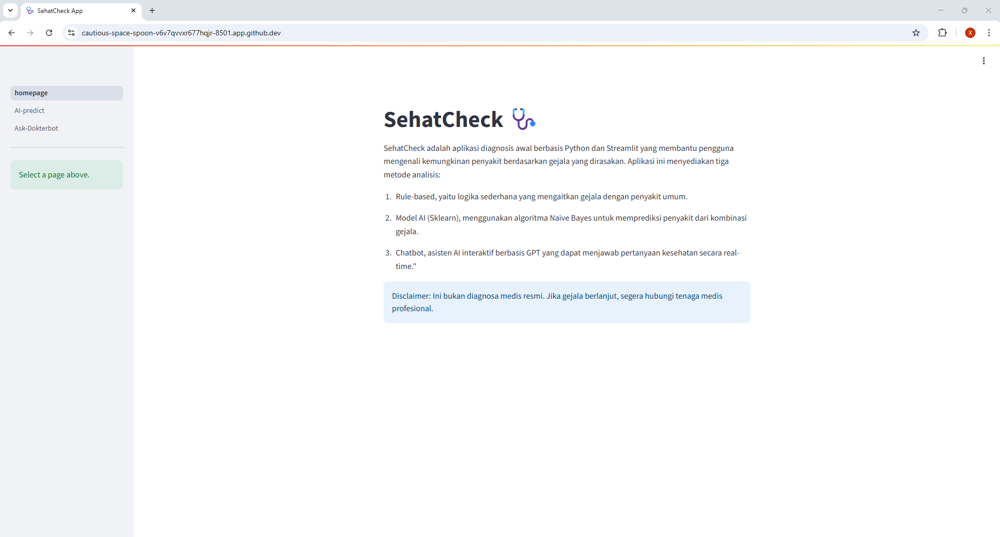
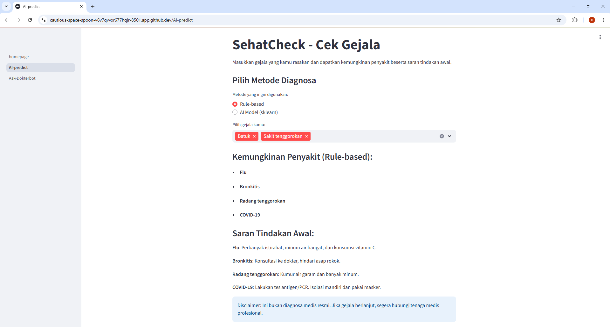
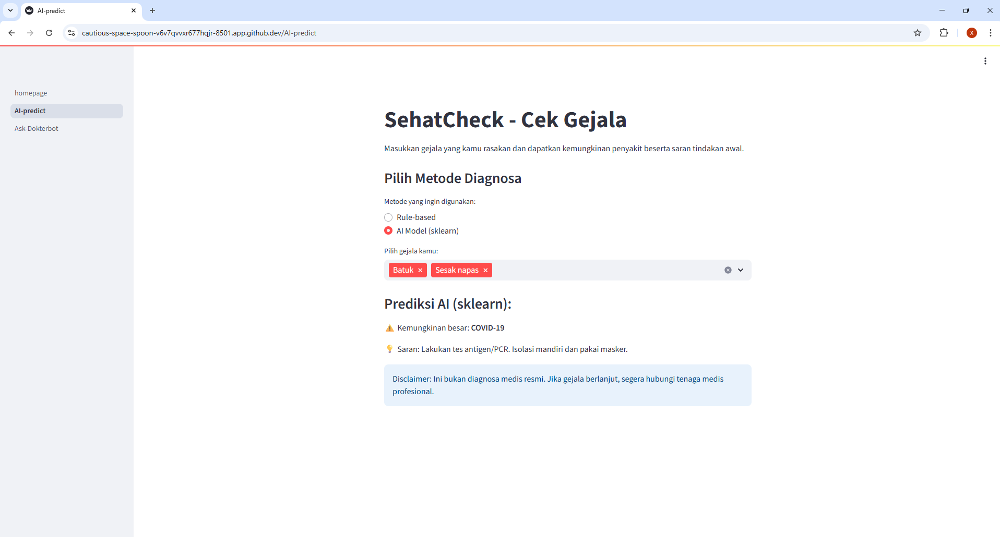
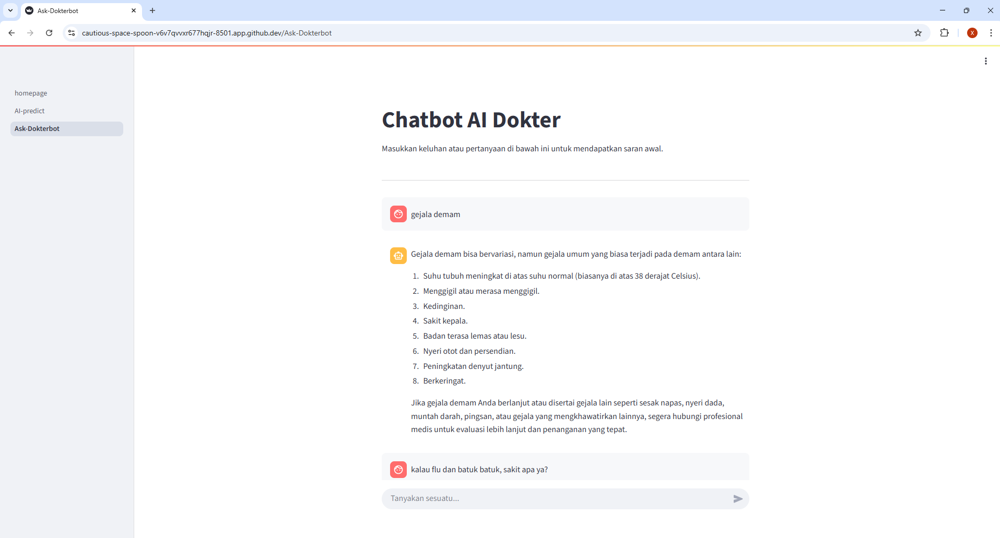

# final_project_REAID
SehatCheck - Cek Gejala dan Saran Kesehatan
    
Deskripsi Singkat
Latar Belakang:Masyarakat sering kali mengalami gejala penyakit ringan namun ragu untuk langsung ke dokter. Aplikasi ini hadir sebagai solusi awal untuk memberikan informasi dan saran berdasarkan gejala yang dirasakan.
Tujuan:Memberikan prediksi kemungkinan penyakit dan saran awal berdasarkan gejala yang dipilih, dengan menggunakan metode:
    - Rule-Based (aturan langsung)
    - Model AI Sklearn
    - Chatbot berbasis ChatGPT

Fitur-Fitur Utama
- Pemilihan gejala secara interaktif
- Diagnosa berbasis aturan (rule-based) dan model AI Naive Bayes
- Chatbot AI Dokter berbasis OpenAI GPT
- Saran tindakan awal berdasarkan hasil prediksi
- Mode ChatGPT aktif real-time tanpa perlu tombol cek
- Cara Menjalankan di Lokal

Clone repositori:
git clone https://github.com/syaikhafaizaarifin99/final_project_REAID.git

Buat environment dan install dependency:
python -m venv venv
source venv/bin/activate  # or venv\Scripts\activate on Windows
pip install -r requirements.txt

Tambahkan file .env untuk API Key OpenAI:
OPENAI_API_KEY=your_openai_api_key

Jalankan Streamlit App:
streamlit run app.py

Preview Aplikasi

*Tampilan utama saat pengguna memilih gejala dan hasil prediksi muncul.*

Link Deploy Aplikasi:
[Akses SehatCheck di sini](https://sehatcheck-cek-diagnosis-penyakit.streamlit.app/) (via Streamlit Cloud)

⚠️ Disclaimer: Aplikasi ini bukan alat diagnosa medis resmi. Hanya untuk edukasi dan referensi awal. Selalu konsultasikan dengan dokter untuk pemeriksaan lanjutan.

